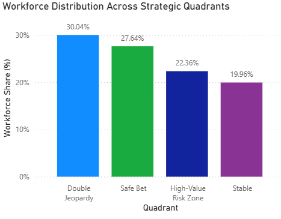
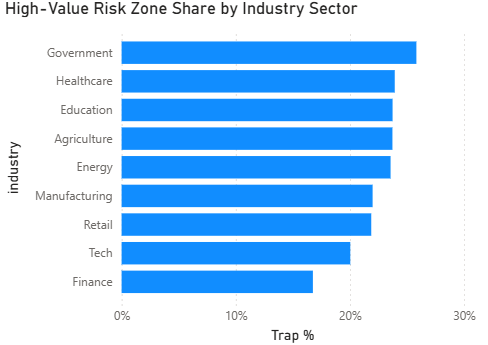
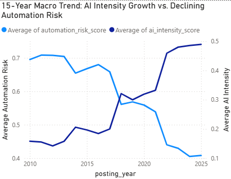
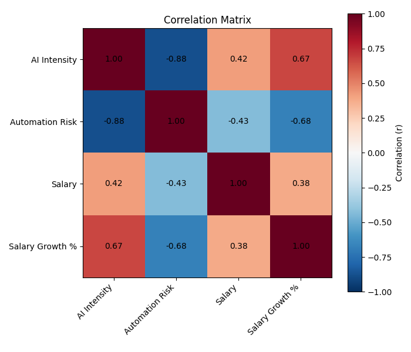

# Targeting the High-Value Risk Zone
### Prioritising AI-Reskilling Investment in the Age of AI

**MAN6777 — Data Analytics Portfolio (Assessment 3)** · Author: Yasaman Khademi Gilchalan

---

## 1. Managerial Problem Definition

In the era of accelerating AI adoption, organisations face a new workforce challenge. The main decision is which employee groups should be prioritised for investment in AI reskilling. The organisation must identify high-salary roles that are highly exposed to automation. These roles are the most financially material to lose, because they combine high salary cost with a high probability of displacement. The decision-maker in this project is the Chief People Officer (CPO) of a mid-to-large technology and operations enterprise, who must allocate a limited learning and development budget across the workforce. Because intuition alone cannot reveal which roles are most at risk, this decision must be grounded in data analysis.

Misallocating the budget is costly in both directions. Overinvesting in secure roles wastes resources, while underinvesting in expensive, at-risk roles exposes the firm to costly talent loss and subsequent rehiring cycles. A data-driven prioritisation allows the CPO to defend budget decisions to the board with evidence rather than intuition. Beyond cost efficiency, directing the budget to where it delivers the highest return strengthens the organisation's long-term sustainability. It builds a more resilient cost structure and turns a simple budget decision into a durable strategic advantage.

## 2. Data Analytics

This analysis draws on the Global AI Impact on Jobs (2010–2025) dataset, comprising 5,000 job listings across 44 countries, 9 industries, and 16 years. Each role was positioned by salary and automation risk, then split at the median into four quadrants.

| Quadrant | Share | Average Salary | Average Risk | What it means |
|----------|-------|----------------|--------------|---------------|
| **High-Value Risk Zone** | 22.4% | $75,938 | 0.78 | high pay, high risk |
| Safe Bet | 27.6% | $98,584 | 0.33 | high pay, low risk |
| Double Jeopardy | 30.0% | $36,907 | 0.78 | low pay, high risk |
| Stable | 20.0% | $38,984 | 0.43 | low pay, low risk |


*Figure 1 — Workforce split across the four strategic quadrants. The High-Value Risk Zone holds 22.4% of all roles.*

Roles that engage with AI carry roughly one-third the automation risk of those that don't, and earn 58% higher salaries. It means AI engagement is the lever that moves a role out of the danger zone and into a better-paid, more durable quadrant. To validate these quadrant patterns statistically, a linear regression and a Python correlation matrix were run on the continuous variables; both confirm that AI engagement strongly predicts lower automation risk, with the full output in the Technical Appendix below.

## 3. Insights and Decision Implications

This analysis points to two clear actions for the CPO.

**Recommendation 1: Launch a targeted AI-reskilling programme for the High-Value Risk Zone.** Direct the first wave of the budget at the 22.4% of roles that are well-paid yet highly exposed, to build their AI skills. The reason is simple: jobs that use AI have about three times less risk of being automated than jobs that don't, so AI reskilling is the most effective protection for these valuable positions.


*Figure 2 — Share of High-Value Risk Zone roles by industry.*

**Recommendation 2: Start with the most exposed industries.** As Figure 2 shows, Government (25.8%), Healthcare (23.9%), and Education (23.7%) hold the largest share of high-value, high-risk roles, so the programme should roll out there first. Finance, the least exposed at 16.8%, can wait. This focuses the limited budget where the threat is greatest, and the payoff comes fastest.

**Risks and uncertainties.** A few cautions remain. The data is artificial, so these numbers should be checked against the company's real HR data before spending any money. The link between AI engagement and lower risk is strong, but it does not prove cause and effect on its own, as industry maturity may also play a part. Finally, the data describes the roles, not the individual people in them, so success will still depend on how well employees adapt to reskilling. The safest path is to pilot the programme in one industry, measure the results, and then scale it.

---

# Technical Appendix: Data Analytics Portfolio

## Data Preparation

The dataset contains 5,000 job listings across 44 countries, 9 industries and 16 years. The core analytical columns had no missing values; the only blanks were in the AI-skill text fields (which are empty when a role has no AI component), and they were kept because the blank itself is meaningful. A quadrant measure was designed by splitting salary and automation risk at their medians. The median was used rather than the mean because salary is right-skewed (mean $63,096 vs median $60,910), so the median gives a fairer high-versus-low split. Two further measures were built: Trap % and an AI engagement label.

## The Great Shift (2010–2025)


*Figure 3 — From 2010 to 2025, average AI intensity rose while average automation risk fell.*

This trend establishes urgency: the labour market is already migrating toward AI-centric roles, so reskilling aligns the workforce with where the market is heading, not just where it is today.

## Regression — Does AI reduce risk?

A simple linear regression (Excel Data Analysis ToolPak, α = 0.05) tested whether AI intensity predicts automation risk.

| Statistic | Value | What it means |
|-----------|-------|---------------|
| R Square | 0.77 | AI intensity explains 77% of the variation in risk |
| Coefficient (slope) | −0.75 | More AI engagement → lower risk |
| Significance F (p) | p < 0.05 | The relationship is statistically significant |

Teaching AI skills is not a vague hope; it is a statistically proven lever for cutting displacement risk. This justifies spending the reskilling budget on AI capability, as stated in Recommendation 1.

## Correlation Matrix — How the key factors connect


*Figure 4 — Pearson correlation matrix of the four numeric variables (produced in Python).*

| Relationship | r | What it means |
|--------------|---|---------------|
| AI intensity ↔ Automation risk | −0.88 | Strong: more AI engagement, far less risk |
| AI intensity ↔ Salary growth | +0.67 | AI roles see faster yearly pay growth |
| Automation risk ↔ Salary growth | −0.68 | High-risk roles see pay stagnate |
| AI intensity ↔ Salary | +0.42 | AI roles are paid more |

The matrix shows AI engagement does three things at once: it lowers risk, raises pay, and speeds up pay growth. The widening pay-growth gap (AI roles grow while at-risk roles stagnate) means inaction is not neutral — every year without reskilling pushes exposed employees further behind. This reinforces the urgency of Recommendation 1.

## Method Note

Two complementary techniques were used. The **regression was produced in Excel's Data Analysis ToolPak** and measures the strength and direction of the continuous AI–risk relationship, while the **correlation matrix was produced in Python** and maps how AI, risk, salary and salary growth all move together. The dashboard was built in Power BI. To avoid multicollinearity, only the continuous `ai_intensity_score` was used in the regression (not the `ai_mentioned` indicator). All statistics use α = 0.05.

---

## Repository Structure

```
automation_trap/
├── README.md                     <- This report
├── images/                       <- Dashboard & chart screenshots
├── Dashboard & Script/           <- Power BI dashboard (.pbix) + Python script
└── Data/                         <- Excel dataset (includes regression sheet)
```

## How to Reproduce the Analysis

This project is fully reproducible across three standard tools.

**Regression (Excel Data Analysis ToolPak):**
1. Open the Excel file and go to the regression sheet.
2. Go to Data → Data Analysis → Regression.
3. Set Input Y Range = `automation_risk_score`, Input X Range = `ai_intensity_score`, tick Labels, and set Confidence Level to 95% (α = 0.05).
4. Click OK to generate the full regression output (R Square, coefficient, Significance F).

**Correlation matrix (Python):**
1. Make sure Python is installed.
2. Open Command Prompt (cmd) and install the libraries:
   ```
   pip install pandas matplotlib openpyxl
   ```
3. Place `correlation_analysis.py` in the same folder as the Excel data file.
4. In cmd, navigate to that folder and run:
   ```
   python correlation_analysis.py
   ```

**Dashboard (Power BI):**
Open the `.pbix` file in Power BI Desktop to explore the interactive dashboard (quadrant split, industry exposure, and the 2010–2025 trend).

## Data Source

Global AI Impact on Jobs (2010–2025), a synthetic dataset grounded in real labour-market trends. Licensed under ODC Public Domain Dedication and Licence (PDDL).

> *Note: the dataset is synthetic and intended for research and education. Figures should be validated against an organisation's own HR data before committing budget.*
